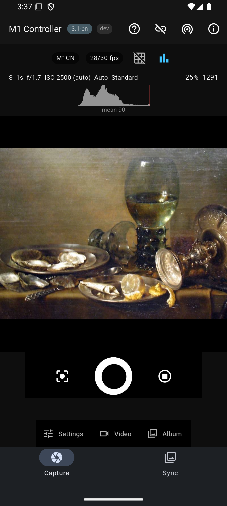
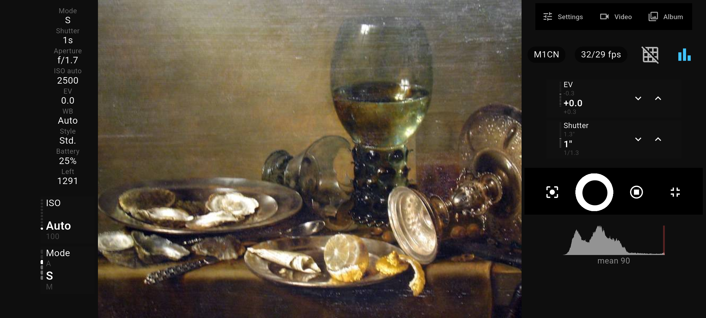
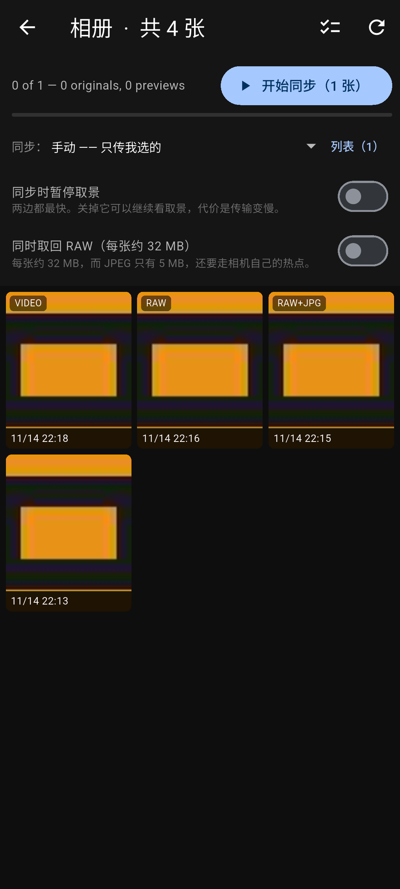
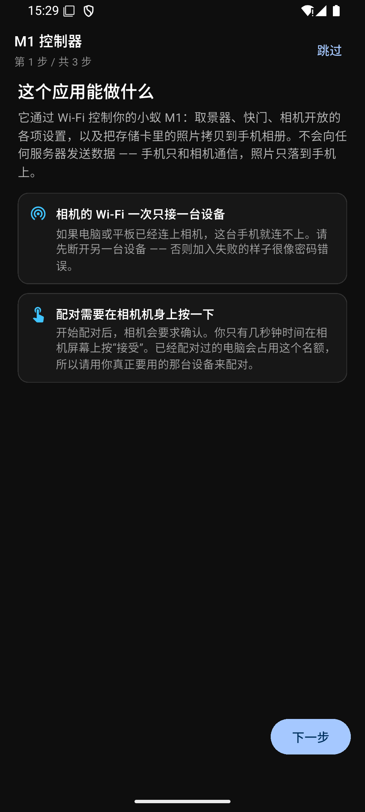

[English](README.md) | 简体中文

# yi-m1-controller-app

**YI M1**（小蚁微单，型号 `C59Y1`）微单相机的开源 Android 控制器，用来替代厂商已经
放弃维护的官方 app。

它通过**低功耗蓝牙（BLE）**与相机配对，从相机读出 Wi-Fi 凭据，加入相机自己开的热点
（`192.168.0.10`），然后用 **HTTP 命令**和 **UDP 54321 的 JPEG 取景流**驱动它，并把
存储卡上的照片同步进手机的系统相册。

本仓库只包含这个应用，别无其他。

> **状态：`0.2.1+3`。** `0.2.0+2` 是第一个公开版本：它的 APK 挂在 GitHub Release 上，
> 用维护者自己的密钥签名（见 `RELEASING.md`）。`app/pubspec.yaml` 里的版本号就是这个
> 产物的身份，每个版本改了什么记在 `CHANGELOG.md` 里。这个应用只在一台相机、一台手机上、
> 由一个人验证过。`CHANGELOG.md` 和下面各节把有证据的部分和没有证据的部分分开写。
>
> 应用自带**英文与简体中文**。默认跟随手机的语言；语言选择器在
> **设置 → 同步 → 系统与诊断 → 语言**（`setting-locale`），立即生效并且会被记住。
> 有两处字符串按平台规则不受这个选择器控制：**启动器图标下面那个名字跟随的是手机的
> 系统语言** —— 启动器在 Dart 跑起来之前就通过 `PackageManager` 从 APK 的资源里读它
> （见下文「启动图标与图标下的名字」）。另一个例外见下文「未经验证，也不作声称」：
> 同步栏那行摘要是英文的，两种语言下都是。
> 它也在应用内声明自己的许可：顶栏的信息按钮（`btn-licences`）打开许可页，页面上列出
> 每一个随附组件，并明确写着这不是厂商的应用。
>
> 这一页是 `README.md` 的中文版。两者不一致时以英文版为准 —— 代码、提交历史和
> `CHANGELOG.md` 都是英文写的。

---

## 截图

<!--
  来源说明 —— 这四张 PNG 是什么，以及它们不是什么。

  它们是这个应用自己界面的截图，原生设备像素（1080x2400 与 2400x1080 @ 420 dpi，
  Pixel 6 级别的 AVD `yi_m1_test`），用 `adb shell screencap` 截取，**没有**缩小；
  下面  的 width 属性只决定显示尺寸。不要把它们放大，也不要重新编码成别的尺寸
  —— 那会让下面关于取景画面与拨盘几何的说法不再成立。

  Build       ：本仓库里应用源码的一次 **debug** 构建，命令是
                `flutter run -d emulator-5554 --dart-define=MARIONETTE=1
                --dart-define=FAKE_CAMERA=1`。`live-view.png` 的顶栏里带着应用
                自己的构建标记，值是 `dev`：`BUILD_STAMP` 的默认值就是 `dev`，
                所以没有传入标记的构建读出来就是一个开发构建。另外三张没有这个标记。
                `FAKE_CAMERA` 会伪造连接和相机的应答；这些图没有跑过相机协议，
                也不能作为「任何命令可用」的证据。
  Camera      ：**没有。** 没有连接或使用任何 M1。这些画面里不存在真实相机。
  Locale      ：`live-view.png` 与 `dials-landscape.png` 是**英文**界面；
                `album-sync.png` 与 `first-run.png` 是**简体中文**。应用默认跟随手机的
                语言（设置 → 语言），所以中文那两张就是一台中文手机不做任何配置时的
                样子，而两张放在一起，正是「两种语言都真的被绘制出来了」的证据，
                而不仅仅是声称支持。
  Preview     ：**合成的，而且是刻意的。** 应用自己的取景接收、JPEG 解码、读数栏和
                直方图全都是真的、在跑 —— 但取景画面里的那幅画是一幅公有领域的绘画，
                不是相机的输出。它是以实测的取景格式（帧序号、时间戳、`0x79CE4283`、
                2272 字节的参数块、SOI 在 +2284）作为数据报喂给正在运行的应用的，
                所以被渲染出来的是应用真实的链路在放一幅静物画。读数栏里的相机状态
                则是维护者那台 M1 的真实一次拍摄（它的 RAW+JPEG、ISO、快门和电量
                数值），为这一帧重放出来。

                **这里没有任何东西被当作「透过这个应用拍到的真实现场照片」来呈现。**
                另一个选择是拍一张书桌、把维护者的家也拍进去，那更糟。
  Grid        ：**两张取景图里构图网格都是关的。** `live-view.png` 与
                `dials-landscape.png` 的网格开关画的都是带斜杠的图标
                （`Icons.grid_off`），画面上也没有画三分线 —— 所以不要把这些图描述成
                「网格已打开」。有取景画面的那两张里直方图是开的；`album-sync.png` 与
                `first-run.png` 根本没有取景画面，所以网格与直方图的开关不出现在它们上面。

  说明文案是刻意双语的：相机是中国产品（小蚁微单），它的用户正是这个应用做本地化的
  原因，而应用的代码和提交历史是英文的。如果你只想要一种语言，把每条说明里的另一行
  删掉即可 —— 其他东西都不依赖它。
-->

> **这四张图是什么 —— 在拿它们评判这个应用之前请先读这段。**
> 它们是这个应用自己界面的截图，原生设备分辨率（1080x2400 与 2400x1080），来自
> 模拟器，**没有连接任何相机**。连接是桩（`FAKE_CAMERA`），画面里那幅公有领域的
> 静物画是通过应用真实的取景链路送进去的 —— 所以布局、读数栏、拨盘和
> 直方图都是应用自己的渲染，而**那张照片不是相机拍的**。两张是英文界面、两张是
> 简体中文界面，因为应用跟随手机的语言。完整来源 —— 构建 flag、语言、以及那张
> JPEG 夹具的确切内容 —— 在上面那段 HTML 注释里。

<table>
<tr>
<td width="50%">



**取景页 · Live view.** 竖屏、已连接、取景在跑 —— 应用自己的渲染。读数栏显示相机
自己的状态；直方图在读数栏和画面之间。这一张是**英文**界面；下面 `album-sync.png`
与 `first-run.png` 是同一个应用的**简体中文**界面。

**English**：Portrait, connected, preview running — the app's own render. The readout
bar carries the camera's own state; the histogram sits between it and the picture.
Shown here in **English**; `album-sync.png` and `first-run.png` below are the same
app in **简体中文**.

</td>
<td width="50%">



**横屏全屏与拨盘 · Landscape full screen with the dials.** 这里的模式是相机回报的
S 档，因此右侧拨盘是 EV 加 S 档控制的那个参数（快门），ISO 与模式留在左侧。
这一张里**构图网格是关着的** —— 顶栏的网格开关画的是带斜杠的图标 —— 直方图在
快门下方。

**English**：S is the mode the camera reported here, so the right rail is EV plus the
parameter S controls (shutter) and ISO/Mode stay on the left. The composition grid is
**off** in this shot — the toggle in the top bar draws the struck-through grid icon —
and the histogram sits below the shutter.

</td>
</tr>
<tr>
<td>



**相册与同步 · Album and sync.** 存储卡上的内容，按 RAW+JPEG 配成一组。勾选只是
把它们**入队**；**真正开始传输的是同步栏** —— 入队永远不会开始传输。

**English**：The card's contents, grouped into RAW+JPEG pairs. Selecting items queues
them; **the sync bar is what starts the transfer** — queueing never starts one.

</td>
<td>



**首次使用与配对 · First run and pairing.** 三步，可以跳过，也能从顶栏重开。配对
需要在**相机机身上按一次「接受」**（Accept），而且相机只保存一个配对。

**English**：Three steps, skippable and reopenable from the app bar. Pairing needs a
physical **Accept** on the camera body, and the camera stores only one pairing.

</td>
</tr>
</table>

---

## 现在能做什么

这里的每一条声称都带标记：**[V]** 表示该行为被观察到并有记录，**[H]** 表示那是判断
或推理，而不是观察。

### 在真机上验证过

- **[V]** BLE 配对、读取 Wi-Fi 凭据、加入相机热点、HTTP 命令，以及远程参数控制
  （光圈、快门、感光度、白平衡）。
- **[V]** 快门真的会拍。机主的原话是*「剩余张数减了，而且它在相册里」* —— 这是
  平台层面的观察，不是一个变绿的按钮。
- **[V]** 相册协议细节在真机上复现过：`Thumbnail` 请求返回的 `204` 意思是
  *「这个分辨率做不出来」*，而不是*「文件不在」*；RAW（`.DNG`）只能在 `Original`
  这一档取回（31.9 MB，是一份真正的 DNG）；`DeleteFile` 要的是 `file_list`
  **数组**，而请求结构写错时，一个存在的文件和一个不存在的文件都会得到 `404`。
- **[V]** 照片会同步进手机的系统相册，而且只有 `IS_PENDING` 被确认清除之后，
  这次写入才算完成 —— 查询结果显示 `is_pending=0`，而不只是返回了一个 URI。
- **[V]** RAW+JPEG 会配成组，勾选其中一条会把两部分一起入队。
- **[V]** **相机没有看门狗。** 在驱动模式为 `Continuous` 时发出一条拍摄命令，会
  开始一次连拍，而只有取消命令能让它停下 —— 相机自己没有任何东西会结束它 ——
  随后相机会卡在那里，必须取出电池。真正让它卡死的是*在连拍过程中发送任何别的
  请求*。所以应用用按住快门来拍摄，并且完全拒绝在 `Continuous` 下拍摄。

### 在桌面上验证过

- **[V]** 跨越协议、传输、同步三层共 686 项纯逻辑断言（传输套件 456 项、同步套件
  230 项），外加 29 项一致性检查，用普通的 `dart` 就能跑，不需要 Flutter 引擎：

  ```powershell
  cd app
  dart tool/verify.dart             # 全部，按顺序跑
  ```

  也可以单独跑：`dart tool/verify_transport.dart`、`dart tool/verify_sync.dart`、
  `dart tool/conformance.dart`。

- **[V]** widget 测试套件，覆盖取景页、相册、查看页、首次使用流程、系统大字体下的
  溢出，以及许可页：

  ```powershell
  cd app
  flutter test
  ```

- **[V]** 完整的连接流程 —— 扫描 → 发现 → 配对 → 读取凭据 → 入网 → HTTP → 已连接
  —— 是对着一台注入进 Android 模拟器无线电里的**虚拟相机**跑的，应用侧零改动：

  ```powershell
  cd app
  flutter run -d emulator-5554 --dart-define=MARIONETTE=1 --dart-define=FAKE_CAMERA=1
  ```

- **[V]** 发布产物是被检验的，而不是被信任的；而且**这项检查本身就随仓库发布**，
  不是只存在于构建它的那台机器上：

  ```powershell
  dart tool/verify_apk.dart build/app/outputs/flutter-apk/app-release.apk --stamp <stamp>
  ```

  它解开 APK，断言八项必需权限都在**打包后**的清单里、没有任何测试 instrument
  进到 dex 或 `libapp.so`、构建标记在发布出去的 `libapp.so` 里，以及这个产物没有
  用公开的 Android 调试密钥签名。

### 限制这个应用能做什么的硬件事实

这些是相机的性质，不是这个应用的性质；也正是几个看起来很明显的功能不存在的原因。

- **[V]** **取景是一条走 UDP 的 JPEG 流**，每个数据报一帧 800×600，大约每秒
  30 帧、**12–14 Mbit/s**。客户端刻意**不做丢帧** —— 那是一个明确的产品决定，
  不是疏忽。
- **[V]** **相机是一个单线程 HTTP 服务，只有一个 Wi-Fi 客户端名额，而且没有任何
  认证。** 任何别的东西跟它说话，都会和取景抢这条路。
- **[V]** **相机没有实时时钟。** 所以每次开机之后，应用都必须通过 BLE 把相机的
  时钟设好，否则每一张照片的拍摄时间都是错的。
- **[H]** 把宿主机的蓝牙直通给 Android 模拟器，在 Windows 上不行：libusb 拿不到
  非 WinUSB 设备。后果是：BLE 这条路只能对着**真手机**跑，或者对着模拟器的
  **虚拟外设**跑 —— 绝不可能通过宿主机的无线电对着你的相机跑。

### 已经写好，但还没在真机上跑过

- **[V]** 即使卡上有照片，`GetMLFileList` 也总是返回 `{"code":200,"data":[]}`。
  原因**不明**。
- **[H]** 相机那 45 条 HTTP 命令里，大约 15 条被实际跑过。
- **[H]** 只用过一台相机和一台手机。换一个固件版本，情况就可能变。

### 未经验证，也不作声称

- **拨盘的外观。** 每个尺寸都是用程序测量出来的，所以被检查的是几何，而不是
  *观感*。
- **真实条件下的取景卡顿。** 这套流在手机上*感觉*如何，没有测量过。
- **取景流的暂停/恢复。** 从未在真机上验证过；而在未验证的情况下用过一次，
  就把相机卡住了。它默认关闭（`pauseStreamDuringTransfer = false`），只作为一个
  显式实验暴露出来（`toggle-pause-stream`）。
- **超出已知范围的连拍。** 满卡速连拍实际会产出什么，没有测量过。
- **USB 与 HDMI 取景输出。** 分析结论是两者都不可行；相机固件里那份完整的 UVC
  描述符是零引用的死代码。不要指望这个功能。
- **一个全中文的界面。** 两种语言都存在，而且有一条检查断言每个 key 在两个文件里
  都有；但有一行用户会读到的字，在哪种语言下都是英文：同步栏那行摘要，它由不含
  Flutter 的同步层生成（`SyncSummary.toString()`），那个文件里也写明它没有做
  本地化。它就出现在上面那张 `album-sync.png` 里（`0 of 1 — 0 originals,
  0 previews`）。至于中文*读起来*好不好，那是判断，不是观察。

---

## 需要的硬件与软件

**硬件**

- 一台 **YI M1**（`C59Y1`）相机，开机、有电。厂商已经放弃这条产品线；本项目与它
  没有任何隶属关系。
- 一台带**低功耗蓝牙**和 Wi-Fi 的 Android 手机，系统 **Android 7.0（API 24）**
  或更高。发布构建面向 `arm64-v8a`。
- 一台用来构建的电脑。本项目是在 Windows 上开发的；除了下面两项跟机器相关的设置，
  构建本身与平台无关。

**软件**

| | 使用的版本 | 说明 |
|---|---|---|
| Flutter | `3.47.4` stable | 由 revision `9584c6713b` 固定在 `app/.metadata` 里 |
| Dart | `3.13.3` | 随 Flutter 提供 |
| JDK | **21** | Android 构建需要一个能 `jlink` 出 `core-for-system-modules.jar` 的 JDK；**JDK 25 会失败**，而失败时 Flutter 给出的提示是误导性的「upgrade your AGP version」 |
| Gradle | `9.3.1` | 经由 `app/android/gradle/wrapper` |
| Android Gradle Plugin | `9.1.0` | `app/android/settings.gradle.kts` |
| Kotlin | `2.4.0` | |
| Android SDK | `compileSdk` 36、`targetSdk` 36、`minSdk` 24、NDK `28.2.13676358` | 继承自 Flutter SDK 的默认值，没有显式写下来 |

---

## 上手

### 1. 克隆

```bash
git clone https://github.com/xiaobaiwud12/yi-m1-controller-app
cd yi-m1-controller-app
```

没有 submodule。构建需要的一切都在这个仓库里。

> 仓库名以 `-app` 结尾是刻意的。产出这些代码的逆向工作 —— 固件镜像、反编译的厂商
> 应用、以及 `app/lib/` 里的注释引用为 `analysis/NN` 的那些分析记录 —— 放在另一个
> **独立的私有**仓库里。它不公开，也无法提供，这就是为什么有些注释引用了你在这里
> 找不到的材料。`tool/verify_release.dart` 会统计这些引用，而这份 README 直接把
> 这件事说出来，而不是让你自己去猜克隆是不是不完整 —— 它没有不完整。

### 2. 没有任何跟机器相关的东西要改

这个仓库早先的版本要求你先改两个文件才能构建。两处都已经修好：

- **`app/android/gradle.properties` 不再固定某一台机器的 JDK 路径。** 只要
  `org.gradle.java.home` 被设了，Gradle 就不看 `JAVA_HOME`，所以那条固定路径会让
  一个完全正常的 JDK 变得不可见，除了 `Java home supplied is invalid` 什么也不
  产出。你自己需要的话可以在自己的机器上设 —— 设在
  `~/.gradle/gradle.properties`（`%USERPROFILE%\.gradle\gradle.properties`），
  那个文件不被任何东西跟踪。如果你的 `JAVA_HOME` 是 **JDK 24 或更新**，你就需要
  它：Android 构建要用 `jlink` 从 `core-for-system-modules.jar` 导出一个 JDK
  镜像，而这一步在 JDK 25 上会失败，失败时 Flutter 给出的提示是误导性的
  「upgrade your AGP version」。JDK 21 可用。
- **Gradle wrapper 在这里是完整的** —— `gradlew`、`gradlew.bat` 和
  `gradle/wrapper/gradle-wrapper.jar` 都已提交，所以从全新克隆出来 `./gradlew`
  就能用。（Flutter 自己的模板把这三个都 gitignore 掉了；这就是为什么这个仓库
  更早的一次导出里，wrapper 根本跑不起来。）

### 2b. 签名：发布构建需要什么，本地构建需要什么

**发布** APK 必须用维护者的密钥签名，密钥从 `app/android/keystore.properties`
读取（`storeFile`、`storePassword`、`keyAlias`、`keyPassword`）。那个文件是刻意
**不**放进这个仓库的：一个能冒充这个应用的密钥，一旦公开就无法收回。没有它，
发布构建会**失败**：

```
Release build refused: no signing key.
Looked for : .../app/android/keystore.properties
```

这个失败正是重点。在 2026-09-16 之前，发布构建类型一直在静默使用**调试**密钥库
—— 一个公开已知的密钥，别名和密码都是固定的，每个 Android SDK 里都带着 ——
那等于任何人都能造出一个 Android 会接受的「更新」。`RELEASING.md` 里有 `keytool`
的调用方式和完整流程。

如果你只是自己构建、不打算分发，那就显式地要调试密钥：

```bash
flutter build apk --release --android-project-arg=allowDebugSigning=true
```

它会打印一条警告，说明你要的是什么；而 `tool/verify_apk.dart` 会拒绝这个产出的
产物，除非你再传 `--allow-debug-signing`。

### 3. 拉取依赖

```powershell
cd app
flutter pub get
dart analyze
```

`dart analyze` 是能拿到的最快信号。它应该是静默的。

### 3b. 验证 —— 一条命令

```powershell
cd app
dart tool/verify.dart
```

这就是这个仓库验证工作的全部：分析器、三套纯 Dart 逻辑测试（合起来 686 项断言，
外加 29 项一致性检查，而且它们必须在*没有* Flutter 的情况下保持能编译 —— 那是一条
架构不变量，不是偏好）、widget 测试、扫过整个仓库的泄漏扫描，以及两项属于发布流程
而不属于应用本身的检查的自检。加上 `--with-android` 会连 Kotlin 的 JVM 单测一起跑
（需要 JDK 和 Android SDK）。

`dart tool/verify.dart` 在每次运行的最后都会打印它**无法**检查的东西的清单 ——
相机、没有公开的固件记录，以及 Android 构建。那份清单是刻意留在输出里的。

### 4. 构建

```powershell
cd app
flutter build apk --release --target-platform android-arm64
```

APK 落在 `app/build/app/outputs/flutter-apk/app-release.apk`。构建会给自己打上短
提交哈希（工作区脏时再加 `-dirty`）的标记，把它渲染到顶栏里，并且如果这个标记
不在发布出去的 `libapp.so` 里就会失败。

然后检查产物本身 —— 这一步不需要 Android SDK，而且它是唯一一项以「用户实际会装的
东西」为对象的检查：

```powershell
dart tool/verify_apk.dart build/app/outputs/flutter-apk/app-release.apk --stamp <the stamp>
```

它读的是**打包后**的清单（那八项必需权限 —— 其中 `CHANGE_NETWORK_STATE` 曾在三轮
里从发布出去的 APK 中缺失，而清单的*源文件*看起来是完整的），在 `classes*.dex` 和
`lib/**/*.so` 里搜索测试 instrument 的标记，在 `libapp.so` 里找构建标记，并拒绝
用调试证书签名的 APK。

有两个编译期接缝，纯粹是为了让那些*连接之后*才存在的界面在没有相机时也能到达：

- `--dart-define=FAKE_CAMERA=1` —— 一台桩相机，只回答界面真正读取的命令。启动时
  它会打印 `FAKE_CAMERA_VERIFICATION_ONLY: simulating a connected camera`。
  **它不是「任何命令可用」的证据。**
- `--dart-define=DIRECT_CAMERA=1` —— 跳过 BLE，直接对一个固定地址的相机说 HTTP。
- `--dart-define=MARIONETTE=1` —— 打开用于开发期间远程驱动应用的 widget 树检查
  通道。

**这三个都不允许出现在发布构建里。** 构建会断言它们的标记字符串不在产物中；
如果你带着其中之一编了一个发布版而构建成功了，那就是一个值得报告的缺陷。

### 5. 运行

```powershell
# 在一台已经和相机配对过的手机上，通过 USB：
cd app
flutter run --release

# 在模拟器上，用一台假相机让「连接之后」的界面能到达：
flutter run -d emulator-5554 --dart-define=MARIONETTE=1 --dart-define=FAKE_CAMERA=1
```

---

## 开发

### 这里能验证什么，不能验证什么

`dart tool/verify.dart`（上面）会跑一切不需要硬件就能跑的东西。**在相信一次绿色的
运行之前，请读它的最后一段**：`app/docs/PROTOCOL.md` 里那些面向相机的结论，是对着
一台真实的 YI M1 得出的，这个仓库里的任何东西都无法重新推导它们。

任何涉及相机的事 —— 配对、加入它的热点、协议、取景流，以及一张照片是否真的出现
在系统相册里 —— **没有硬件就无法验证**。没有任何模拟器能替代它。

### 唯一的一条规矩

**每一个新能力都需要一条真的能失败的检查。** 「代码写了」不算完成。修 bug 应该
带着那条本可以抓住它的检查一起来，而且那条检查要留下。见 `CONTRIBUTING.md`。

### 目录结构

| 路径 | 是什么 |
|---|---|
| `app/lib/protocol/` | 线格式、45 条命令表、参数池、坐标映射、布局数学。**没有 Flutter。** |
| `app/lib/transport/` | BLE、HTTP、取景、相册、Wi-Fi 加入、拍摄互锁。其中有四个文件 import 了 Flutter（`file_pairing_store.dart`、`flutter_ble_transport.dart`、`screen_control.dart`、`wifi_joiner.dart`），两个纯 VM 校验程序不 import 它们。 |
| `app/lib/sync/` | 传输队列、同步账本、暂停契约。**没有 Flutter。** |
| `app/lib/platform/` | 那些确实需要 Flutter 的实现：MediaStore、文件 sink。 |
| `app/lib/state/` | `AppState`，唯一的状态源。 |
| `app/lib/ui/` | 页面与控件。可交互控件都带 `ValueKey<String>` 名字（`btn-*`、`toggle-*`、`banner-*`），这样它们可以被远程定位。 |
| `app/lib/l10n/` | 翻译源文件（`app_en.arb`、`app_zh.arb`）和生成的 `AppLocalizations`。 |
| `app/tool/verify*.dart` | 686 项纯 VM 断言（transport 456 + sync 230），外加 29 项 conformance 检查，以及 `verify.dart`（入口）、`verify_release.dart`（泄漏扫描）、`verify_apk.dart`（产物检查）和 `verify_icon.dart`（启动图标）。全都能用普通的 `dart` 跑，不需要 Flutter 引擎。 |
| `app/test/` | widget 测试、溢出与字号缩放测试、夹具。 |
| `app/android/` | Kotlin：`MediaStorePublish`、`WifiJoinDiagnosis`、`MediaKind`，外加 JVM 单测。 |
| `app/testdata/liveview/` | 从相机抓下来的 40 个真实 UDP 数据报。`tool/verify_transport.dart` 会读它们，缺了它们帧格式检查就跑不了。 |
| `app/docs/PROTOCOL.md` | 客户端所依据的线协议参考，每一条都带一个置信度标记。 |

三个不含 Flutter 的层是硬约束，不是风格偏好：`dart tool/verify_transport.dart` 和
`dart tool/verify_sync.dart` 必须继续在一个没有 Flutter 引擎的纯 Dart VM 里编译并
运行 —— 它们都不 import `app/lib/transport/` 里那四个确实 import 了 Flutter 的
文件 —— 而这就是 686 项断言能在几秒内跑完的原因。`app/lib/protocol/` 与
`app/lib/sync/` 里完全没有 `package:flutter` 的 import。

---

## 安全须知

相机是一个**单线程 HTTP 服务，只有一个 Wi-Fi 客户端名额**，而且没有认证。下面三条
规则之所以存在，是因为破坏它们付出过真实的硬件时间代价。它们在代码里被执行，
而不仅仅写在文档里：

1. **把一次下载放进队列，不等于开始传输。** 开始它的是同步栏。
2. **已经在手机上的照片，永远不会再从相机取一次。** 查看页读的是手机自己的那份副本，
   所以已同步的照片在相机关机时也能打开。**未同步**的照片在打开时可以自己取**一张**
   `MidThumb` 预览图 —— 这条规则是被有意收窄的，条件是三条：任何时刻只有一个相机请求
   在飞（全应用共用一个闸门，与网格、同步引擎共用，屏幕上的那张优先）；页面翻走时
   **还在排队**的请求**根本不发**；失败必须显示出来，而不是一直转圈。取**原图**仍然
   必须由用户显式按按钮。
3. **取景流的暂停/恢复默认关闭**，因为它从未在真机上验证过。

另外：相机的热点**一次只接纳一个客户端**。一台手机和一台 PC 不能同时挂在上面，
而第二个连不上的样子看起来就像密码错了。

---

## 参与、安全、许可

- `CONTRIBUTING.md` —— 这个项目会接受什么、不会接受什么。
- `SECURITY.md` —— 怎么报告漏洞，以及为什么相机自己的协议不在范围内。
- `CHANGELOG.md` —— 每一项值得记录的改动。
- `LICENSE` —— **Apache License 2.0**。`NOTICE` 列出这个应用所基于的第三方组件，
  以及它们的许可要求你随附的声明。

本节提到的这几份文档目前**只有英文版**：这个仓库里只有这一页有中文版本。

本项目是一个独立的第三方控制器。它与 YI M1 的制造商没有隶属、背书或支持关系。
「YI」「Xiaoyi」和「YI M1」是各自所有者的商标，在这里只用来说明这个软件是做什么
用的。没有随附任何厂商的美术资源、logo 或素材 —— 启动图标是本项目自己的作品
（见 `NOTICE` §6），几何形状由本项目自己定义并保存在本仓库里。

---

## 启动图标与图标下的名字

- **[V]** 应用有了自己的图标：一个镜头环，中间是白色镜片，右上方两道向外扩散的
  广播弧线 —— 「用无线链路指挥的相机」。它是**本项目的原创作品，按本项目的许可发布**，
  其中没有任何厂商的美术资源、字标或商业外观；`NOTICE` §6 记着它是什么，也特意记着
  它**不是**什么。它是一个真正的自适应图标，而不是一张位图：`mipmap-anydpi-v26/`
  放前景与背景图层，`mipmap-anydpi-v33/` 多一层 `<monochrome>`，所以 Android 13+
  可以按用户的壁纸配色给它重新上色；`mipmap-{m,h,xh,xxh,xxx}dpi/` 里是 API 24–25
  用的十张传统 PNG。所有产物都由同一组几何常数推导出来。
- **[V]** 图标下面那个名字是字符串资源，有英文和中文两个值
  （`app/android/app/src/main/res/values/strings.xml` 与 `values-zh/`），不是字面量，
  所以中文手机显示中文名。
- **它跟随哪一种语言是平台属性，不是这个应用里的设置。** 启动器通过
  `PackageManager` 按**系统**语言解析 `android:label`，这发生在 Dart 跑起来之前，
  所以应用内的语言选择器影响不了它：系统设成英文的手机，即使在这个应用里选了中文，
  图标下面仍然是英文名，反过来也一样。这里把它写清楚而不是含糊过去，因为它是应用内
  本地化永远够不到的那一个可见字符串 —— `app/lib/l10n/app_*.arb` 只提供 Dart 代码
  渲染的文字。
- **[V]** 这个图标有一条会失败的检查：`dart tool/verify_icon.dart`，115 项断言。
  它用真正的解码器（zlib 与全部五种扫描线滤波器）解出那十张 PNG，而不是读文件头；
  断言它们既不是空白、也不是单色、彼此也不重复；要求圆形图标真的是圆的；并且通过解析
  写出来的矢量**重新推导**安全区算术，而不是复用生成器自己的数字。它读的是 `res/`
  与清单，所以在这个仓库里能跑；它不在 `dart tool/verify.dart` 的流程里。
